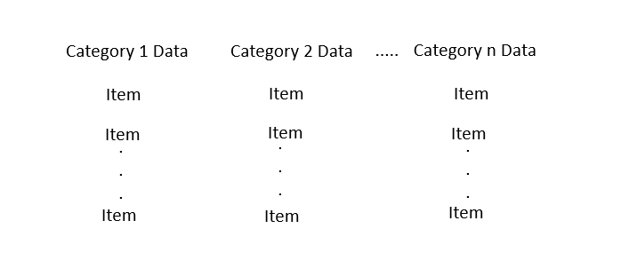

# Image to Spreadsheet Script 

Image to Spreadsheet is a python script designed to automate the data entry process by extracting information from a photo and placing it into a spreadsheet. This cuts the time spent manually entering data into a spreadsheet from hours to minutes. Which can then be used for a person's other tasks. 

## Table of Contents
* [Dependencies](#dependencies)
* [Usage](#usage)
* [Future-Plans](#what's-Next?)  

## Dependencies

* Tesseract OCR  

    If you don't have Tesseract on your device, you can download it [**here**](https://tesseract-ocr.github.io/tessdoc/Installation.html).
* Pytesseract
    
    Type "**pip install pytesseract**" in your command line interface (CLI) to install the python wrapper for Tesseract OCR

## Usage

**Note**: If you're providing a photo of handwritten data then the accuracy of the result is dependent on the quality of input 

1. Ensure that python is installed
2. Ensure that your data is in the correct format as shown below
3. Take a photo of your data
4. In a CLI, go to the directory that this project is stored in
5. Type "**python run_script.py _Image File_**" into your CLI

## What's Next?

**Note**: I'm currently a university student, so any updates to this project might be slow.    

1. Data sorting algorithm
2. Creating a GUI
3. Support for different spreadsheet file extensions